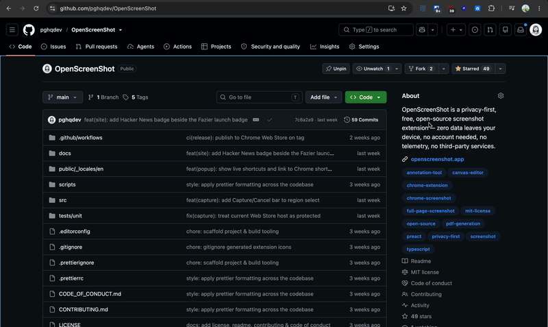

<div align="center">

# OpenScreenShot

**Open-source screenshot tool for Chrome** — full-page, region, and visible-area capture with a built-in annotation editor and PDF export. 100% local and private: works fully offline, and your screenshots never leave your device.

[](https://chromewebstore.google.com/detail/hdabbojjccojlapnfjpdppcpfcnhgmdp)
[](https://chromewebstore.google.com/detail/hdabbojjccojlapnfjpdppcpfcnhgmdp)
[](./LICENSE)
[](./manifest.json)

### [**➜ Add to Chrome**](https://chromewebstore.google.com/detail/hdabbojjccojlapnfjpdppcpfcnhgmdp) &nbsp;·&nbsp; [Website](https://openscreenshot.app) &nbsp;·&nbsp; [Docs](https://openscreenshot.app/docs/) &nbsp;·&nbsp; [Support](https://openscreenshot.app/support/)



</div>

---

Capture the **entire scrolling page** (scroll-and-stitch), the **visible viewport**, or a **selected region** — then annotate the result and export as PNG, JPEG, WebP, or PDF. Built as a Manifest V3 extension with no servers, no accounts, and no telemetry.

## Features

- 📄 **Full Page** — scroll-and-stitch the whole page top to bottom with live progress; fixed headers are composited once at the top. Works on pages that scroll an inner element, too.
- 👁 **Visible Area** — capture exactly what's on screen right now
- ✂️ **Selected Region** — click & drag to grab an area, with a Capture/Cancel bar to confirm
- ✏️ **Annotation editor** — rectangle, arrow, pen, text, blur, crop; select, move/resize, undo/redo; color, stroke width & font size remembered across sessions
- 💾 **Export** — PNG, JPEG, WebP, and PDF (single or multi-page with overlap), or copy straight to clipboard with `Cmd/Ctrl+C`
- ⚙️ **Settings** — theme, default format, quality, filename template, PDF defaults
- 🎨 **Polished & accessible** — dark/light UI, modal focus trap, toolbar arrow-key navigation

<div align="center">


</div>

## Install

**From the Chrome Web Store** — [**Add to Chrome**](https://chromewebstore.google.com/detail/hdabbojjccojlapnfjpdppcpfcnhgmdp). That's it.

**From source** — see [Getting started](#getting-started) below.

## Tech stack

- **TypeScript** (strict) + **Preact** for the popup/editor UI
- **Vite** + **[@crxjs/vite-plugin](https://github.com/crxjs/crxjs)** for Manifest V3 bundling & HMR
- **Canvas compositing in-page** via on-demand `chrome.scripting` injection (no offscreen document needed)
- **[jsPDF](https://github.com/parallax/jsPDF)** (lazy-loaded, zero vulnerabilities) for PDF export
- **Vitest** for unit tests, **Playwright** for e2e (planned)

## Getting started

### Prerequisites

- Node.js 22+
- npm 10+

### Install & develop

```bash
npm install
npm run icons      # generate the extension icons into public/icons
npm run dev        # start Vite + crxjs with HMR (writes to dist/)
```

Then load the extension in Chrome:

1. Open `chrome://extensions`
2. Enable **Developer mode** (top right)
3. Click **Load unpacked** and select the `dist/` folder

### Build for production

```bash
npm run build      # type-check + bundle into dist/
```

Load `dist/` as an unpacked extension, or run `npm run package` to produce
`openscreenshot-vX.Y.Z.zip` for the Chrome Web Store.

### Scripts

| Script              | Description                                      |
| ------------------- | ------------------------------------------------ |
| `npm run dev`       | Vite dev server with extension HMR               |
| `npm run build`     | Type-check and bundle the extension into `dist/` |
| `npm run typecheck` | Run `tsc --noEmit`                               |
| `npm run lint`      | ESLint (flat config)                             |
| `npm test`          | Run unit tests (Vitest)                          |
| `npm run icons`     | Regenerate extension icons from the SVG source   |
| `npm run format`    | Format the codebase with Prettier                |
| `npm run package`   | Build + zip `dist/` for store submission         |

## Project structure

```
openscreenshot/
├── manifest.json            # MV3 manifest (crxjs entry)
├── public/
│   ├── icons/               # generated extension icons
│   └── _locales/en/         # i18n messages
├── src/
│   ├── background/          # service worker (capture coordinator)
│   ├── content/             # on-demand capture funcs (scroll, region)
│   ├── editor/              # annotation editor + export (Preact, own tab)
│   ├── popup/               # popup UI (Preact)
│   └── shared/              # design tokens, messaging, storage, types, utils
├── tests/                   # unit + e2e tests
└── scripts/generate-icons.mjs
```

## Permissions

OpenScreenShot requests the minimum permissions needed:

- `activeTab` — access the current tab when you click the extension or use a shortcut
- `scripting` — inject on-demand page functions for scroll-and-stitch & region selection
- `storage` (+ `unlimitedStorage`) — settings/onboarding state and stashing large full-page PNGs for the editor
- `downloads` — save exports to your downloads folder
- `options_ui` — the editor is registered as a full-tab options page so crxjs bundles it; it's opened in a tab after each capture

We never request broad host permissions (`<all_urls>`) — `activeTab` grants access on your click/shortcut, and `scripting` runs within that grant.

## Privacy

**100% local. 100% private. Works fully offline.**

Your screenshots never leave your device — there are no servers, no accounts, no sign-ups, and no tracking. Every capture, edit, and export happens right inside your browser, so nothing is ever uploaded, stored in the cloud, or seen by anyone but you. You could pull the network cable and it would work exactly the same.

Read the full [Privacy Policy](./PRIVACY.md).

## Contributing

Contributions are welcome! See [CONTRIBUTING.md](./CONTRIBUTING.md). Please follow the [Code of Conduct](./CODE_OF_CONDUCT.md).

## License

[MIT](./LICENSE) © OpenScreenShot Contributors
